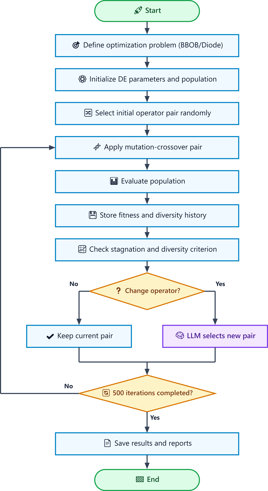

# llm-guided-de-diode-optimization-ssci2027
Official repository for the SSCI 2027 paper on Large Language Models, Differential Evolution, Adaptive Operator Selection, Automated Algorithm Design, and solar-cell diode model optimization.

**Abstract** Large language models (LLMs) have demonstrated promising capabilities for the automatic design and refinement
of metaheuristic algorithms. This paper proposes an adaptive framework guided by an LLM for the dynamic selection of mu-
tation and crossover operators in the Differential Evolution (DE) algorithm. The DE algorithm’s structural integrity is maintained,
with the LLM acting as a high-level selector among a predefined set of operator combinations. An external mechanism is employed
to monitor the objective function and population diversity. The LLM is activated only when stagnation or a significant loss of
diversity is detected. In light of the present search stage and the historical performance of the evaluated configurations, the LLM
determines the subsequent operator combination. The proposed strategy is evaluated using the BBOB benchmark suite and on a
double-diode photovoltaic model. This approach enables an analysis of the proposal’s overall optimization behavior and efficiency
in a nonlinear inverse problem. The findings indicate that the proposed framework reduces reliance on manual configurations
and facilitates the adaptation of the DE algorithm to real-world engineering problems.

Proposed Methodology

  

The workflow illustrates the proposed LLM-guided Differential Evolution framework. The algorithm initializes the optimization problem, population, and operator pair, then iteratively applies mutation and crossover operators while monitoring fitness improvement and population diversity. When stagnation or diversity loss is detected, the LLM is invoked to select a new operator pair. The process continues for 500 cycles and finally saves the resulting performance data and reports.
